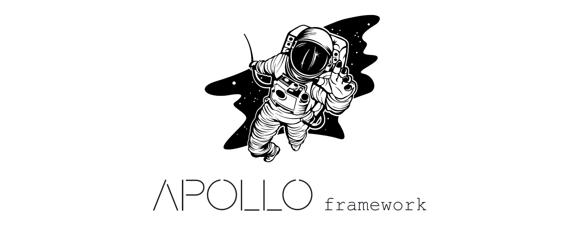

<!--

This will be updated soon 

## What is APOLLO ?

Apollo is a Next Framework for Machine Learnig

## Main characteristics
- [x] Easy use
- [x] C
- [ ] C++
- [x] Integrated
- [x] High-Performance

## Get staterd

In construction
-->
